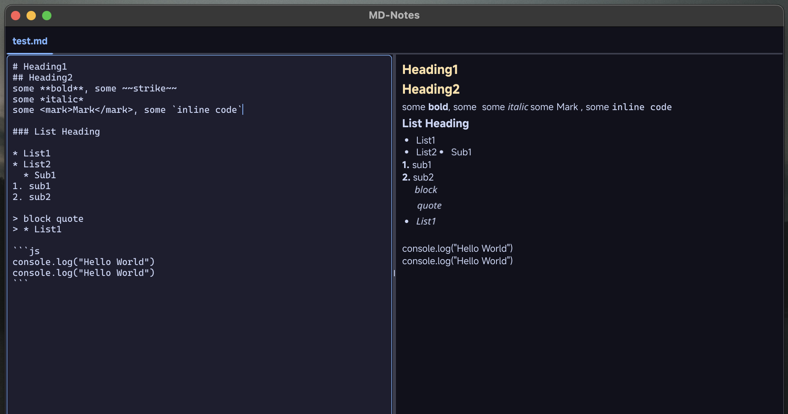

# MD-Notes

MD-Notes is a lightweight Markdown editor and viewer built with Go and the Fyne toolkit. It provides a clean, distraction-free environment for writing and previewing Markdown documents.

<p align="center">
  
</p>

## Features

- **Split-View Interface**: Edit Markdown on the left, see the rendered preview on the right
- **Tabbed Editing**: Work on multiple documents simultaneously
- **Dark Theme Support**: Easy on the eyes for long writing sessions
- **Auto-save Capability**: Never lose your work
- **Cross-Platform**: Works on macOS, Windows, and Linux

## Installation

### Prerequisites

- Go 1.16 or later
- Fyne dependencies (see [Fyne Getting Started](https://developer.fyne.io/started/))

### Building from Source

1. Clone the repository:
   ```
   git clone https://github.com/devallabharath/md-notes.git
   cd md-notes
   ```

2. Build the application:
   ```
   go build
   ```

3. Run the application:
   ```
   ./md-notes
   ```

## Usage

- **Opening Files**: Launch the application with a file path as an argument, or use the default test file:
  ```
  ./md-notes path/to/your/file.md
  ```

- **Editing**: Type in the left panel to edit your Markdown
- **Preview**: See the rendered Markdown in real-time in the right panel
- **Tabs**: Each file opens in its own tab for easy navigation

## Project Structure

- `core/`: Configuration and core functionality
- `markdown/`: Markdown parsing and rendering
- `themes/`: UI themes and styling
- `ui/`: User interface components
- `utils/`: Utility functions

## License

[MIT License](LICENSE)

## Contributing

Contributions are welcome! Please feel free to submit a Pull Request.